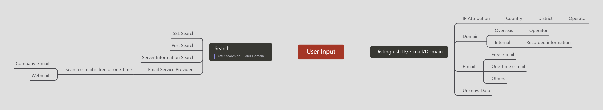

# email_domain_hog

​	The logic diagram of the program design is as follows 

​	Currently, the data is passed into the classification module for classification and labeling, and then the output is passed out as JSON data, and then the secondary classification script is used for secondary classification. It will be gradually optimized into a script and implement the port query.
